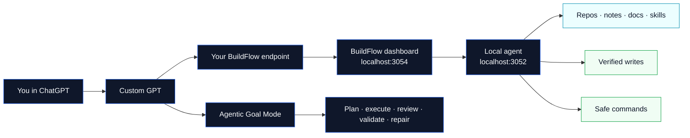
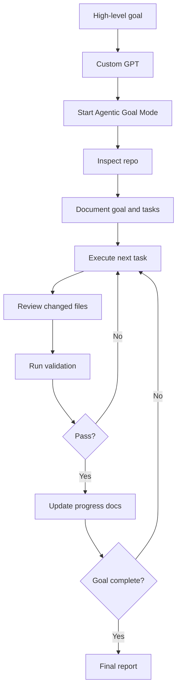

# BuildFlow

**BuildFlow turns ChatGPT into a local, repo-aware AI workbench.**

Connect a Custom GPT to your own computer, give it safe access to your repos, notes, docs, plans, and knowledge folders, then let it inspect real files, search local context, create plans, apply verified changes, run safe validation commands, and work through long implementation goals.

BuildFlow is free, self-hosted, and local-first. It is for builders who want ChatGPT to work with their actual project context instead of guessing from pasted snippets.

If this project helps you, please **star it, fork it, try it on a real repo, open issues, request features, and share what you build with it.**



## Why BuildFlow exists

AI coding tools are powerful, but they often work in the wrong place.

A remote model may not see your local repo. A browser chat may not be able to run your local tests. A CLI agent may have strong execution but weak long-term planning context. Copying files back and forth wastes time and breaks flow.

BuildFlow bridges that gap.

It keeps ChatGPT as the main interface while your own machine remains the source of truth. Your Custom GPT can ask BuildFlow for exact repo context, read the files it needs, write verified changes back to disk, run allowlisted validation commands, and keep a progress trail.

The result is a ChatGPT-first workflow for real local projects.

## What you can build with it

BuildFlow is useful for much more than asking questions about a codebase.

You can use it to:

- build a new app feature from a single high-level goal
- refactor an existing app across multiple files
- fix failing endpoints or broken tests
- create and update project documentation
- generate implementation plans, specs, runbooks, and task lists
- improve your personal knowledge repo, brain repo, or notes system
- maintain local AI skill folders and prompt libraries
- search across multiple projects from ChatGPT
- review repo structure before starting work
- safely apply code edits with verified file operations
- validate JSON files, type checks, tests, and package scripts
- run named security scans over changed files
- prepare clean git diffs, staged file lists, commits, and push flows with guardrails
- create handoff prompts for Codex, Claude Code, your IDE, or another local tool
- continue planning or reviewing from your phone while your local machine hosts the repo connector

## The value in one sentence

**BuildFlow lets you use ChatGPT as the reasoning layer and your local computer as the execution layer.**

That means you can brainstorm, inspect, plan, edit, validate, and iterate on real local projects without turning every task into a separate hosted API workflow.

## Key features

### ChatGPT-first local repo access

BuildFlow exposes a Custom GPT action schema so ChatGPT can talk to your local BuildFlow endpoint.

Your GPT can:

- check BuildFlow status
- list connected sources
- choose active context
- inspect file trees
- search indexed local files
- read exact files
- create planning artifacts
- apply safe file changes
- run allowlisted validation commands
- track Agentic Goal Mode jobs

### Local source management

Add repos, notes, docs, skills, or business folders as BuildFlow sources.

BuildFlow supports:

- one or multiple active sources
- local indexing and search
- recursive repo discovery from a root folder
- auto-generated source IDs and labels
- account-style grouping by folder
- manual reindexing
- optional per-source auto-index settings
- searchable status reporting for ChatGPT and the dashboard

### Verified file writes

BuildFlow can write files, but it does not blindly mutate your machine.

It supports:

- create
- append
- overwrite
- patch
- move
- rename
- mkdir
- rmdir
- delete file
- delete directory where policy allows
- dry-run / preflight checks
- confirmation-required operations
- verified write results with `verified:true`

The current repo-maintainer profile is intentionally practical for Agentic Goal Mode. It can edit normal app code, tests, docs, scripts, package manifests, framework config, Docker files, Prisma files, migrations, and source-controlled project assets without stopping for every routine change.

A write is not considered successful unless BuildFlow verifies it on disk.

### Safe command runner

BuildFlow can run repo-local commands through a strict allowlist.

Supported command families include:

- git status, diff, branch, and log checks
- cached git diff checks
- explicit `git add -- <paths>` only
- hands-off commit and push flows when explicitly requested, with safe path, message, remote, branch, and force-push checks
- JSON validation with `python3 -m json.tool`
- package type checks and tests
- safe package scripts by name, including scripts from the repo root
- marker-based test runs where supported
- named security scans
- BuildFlow verification scripts

BuildFlow does **not** expose arbitrary shell execution. More command capability should be added as named, source-relative command kinds instead of unrestricted terminal access.

### Agentic Goal Mode

Agentic Goal Mode is the newest BuildFlow workflow.

It is designed for prompts like:

```text
Use BuildFlow Agentic Goal Mode on source my-app.

Goal:
Build a complete project intake module with pages, API routes, validation, tests, and documentation.

Work hands-off until complete, blocked, or confirmation-required. Create or update progress documentation, execute one task at a time, review each task, validate, repair failures, commit, push, and continue until done unless a hard blocker requires manual intervention.
```

When started, BuildFlow creates a repo-agnostic goal job and guides the Custom GPT through this cycle:

1. inspect the selected source
2. document the goal, assumptions, constraints, tasks, and validation plan
3. execute the next task with verified local writes
4. review changed files and command output
5. update progress documentation
6. run validation
7. repair failures
8. continue immediately to the next task instead of stopping after a report
9. repeat until complete, blocked, failed, or a hard blocker is reached
10. commit and push the finished work after validation passes
11. produce a final report with validation evidence and git state

Default Agentic Goal Mode settings:

```text
Autonomy: hands_off_safe
Review: after every task
Progress doc: docs/product/agent-mode-progress.md
Max loop iterations: bounded
Commit/push: automatic after validation
```

This gives you a Codex-style goal loop inside ChatGPT while keeping BuildFlow as the local safety and execution layer.

### Persistent resume and handoff

Agentic Goal Mode keeps a repo-local handoff path and a persistent local job record. Jobs are stored outside the chat process, so a new Custom GPT conversation can list or resume them after an interruption, browser refresh, or local service restart.

The Custom GPT should update the handoff after each meaningful chunk with completed work, next task, validation evidence, blockers, rollback notes, and resume instructions.

That means a later conversation can say:

```text
Resume Agent Mode on source <sourceId> where it left off.
```

BuildFlow can then list the latest job, read the handoff document, verify source scope and git status, and continue from the next unchecked task.

### OpenAI Custom GPT interface limits

BuildFlow cannot directly rename ChatGPT’s native conversation titles, batch names, or input placeholder. Those UI elements are controlled by OpenAI’s ChatGPT interface, not by the BuildFlow action schema.

The practical workaround is to use one source per conversation, start prompts with the source name, and rely on persistent repo-local handoff documents. If your ChatGPT client supports manually renaming a conversation, rename it to the repo or goal.

## Effective Agentic Goal Mode prompts

Use this pattern for serious work:

```text
Use BuildFlow Agentic Goal Mode on source <sourceId>.

Goal:
<describe the feature, fix, refactor, or app you want built>

Work mode:
- Work hands-off.
- Create or update progress documentation.
- Execute one task at a time.
- Review each task.
- Run validation after changes.
- Repair failures and continue.
- Do not stop unless complete, blocked by BuildFlow policy, or explicit confirmation is required.

Validation:
Run the relevant type checks, tests, JSON validation, security scans, and git status checks available through BuildFlow.

Git:
Commit and push the finished work after validation passes.
```

### Example: build a feature

```text
Use BuildFlow Agentic Goal Mode on source tradebot.

Goal:
Implement the missing failing endpoint fixes and make the API test suite pass.

Work hands-off. Create or update progress documentation, inspect the repo, make an implementation plan, execute each task, review changed files, run validation, repair failures, and continue until complete or blocked.

Do not ask for intermediate approval unless BuildFlow requires confirmation. Commit and push after validation passes.
```

### Example: build a module

```text
Use BuildFlow Agentic Goal Mode on source my-app.

Goal:
Build a complete project intake module with pages, API routes, validation, tests, and documentation.

Use repo-local conventions. Inspect before writing. Continue through planning, implementation, review, validation, repair, and documentation updates until complete.
```

### Example: refactor safely

```text
Use BuildFlow Agentic Goal Mode on source prochat.

Goal:
Refactor the account settings flow into a cleaner service/module structure without changing external behavior.

Document the current structure and risks, plan the refactor, execute task by task, review each task, run validation, repair failures, and update progress documentation until complete.
```

### Example: improve a knowledge repo

```text
Use BuildFlow Agentic Goal Mode on source brain.

Goal:
Clean up my AI skills folder, improve naming consistency, add README files where useful, and create an index of the most important skills.

Work hands-off, but stop if BuildFlow blocks access to private or secret folders.
```

### Example: prepare a commit

```text
Use BuildFlow Agentic Goal Mode on source buildflow.

Goal:
Improve the dashboard source picker onboarding flow.

Work hands-off until validation passes. Then prepare a clear commit message, commit, push, and continue.
```

## What BuildFlow can do today

BuildFlow Local currently includes:

- local dashboard on `http://127.0.0.1:3054/dashboard`
- local agent on `http://127.0.0.1:3052`
- relay support for reachable Custom GPT endpoints
- source management for repos, notes, docs, skills, and local folders
- recursive repository discovery from a root folder
- local indexing and search
- active source context selection
- multi-source context support
- read batching for large files and large response budgets
- safe write mode controls
- dry-run and preflight write checks
- practical repo-maintainer write permissions for app, docs, scripts, config, migrations, assets, and package manifests
- confirmation-gated sensitive writes
- verified file operations
- local activity feedback for Custom GPT actions
- dashboard activity overview
- local plans and tasks
- local plan import/export
- dynamic handoff prompts for Codex and Claude Code
- safe command runner for validation and git workflow checks
- Agentic Goal Mode for long-running implementation loops
- persistent Agent Mode jobs with handoff and resume instructions
- conversation source-locking guidance for multiple simultaneous GPT chats
- first-run setup checklist
- user-owned Custom GPT OpenAPI endpoint setup

## Safety, benefits, and risks

BuildFlow is powerful because it connects ChatGPT to your local workspace. That also means it needs clear boundaries.

### Benefits

- ChatGPT can work with real files instead of pasted snippets.
- Your local repos remain the source of truth.
- Long implementation work can be planned, executed, reviewed, and validated in one ChatGPT workflow.
- Writes are policy-checked and verified.
- Commands are allowlisted instead of arbitrary.
- Routine repo-maintainer work can continue without constant confirmation stops.
- Sensitive paths require confirmation or remain blocked.
- You can keep project planning, implementation notes, and final reports together.
- Interrupted Agent Mode work can resume from persisted job state and repo-local handoff docs.

### Risks

- Any tool that can edit files can break code if given a vague or risky goal.
- A Custom GPT can misunderstand intent if the prompt is ambiguous.
- Long-running work can touch many files, so review diffs before committing.
- Command execution must stay allowlisted; unrestricted shell would be unsafe.
- Secrets and real environment values should not be exposed to ChatGPT.
- Push flows should run only when explicitly requested or enabled by Agent Mode policy. Deployment flows should stay allowlisted rather than arbitrary shell.

### Important limitations

BuildFlow does not silently edit real `.env` files, expose secrets, run arbitrary shell commands, force-push, or deploy with unrestricted terminal access.

Routine app work is intentionally less interrupted now: package manifests, framework config, Docker files, scripts, migrations, and source-controlled assets can be edited under the repo-maintainer policy. The hard boundary is secrets, generated/runtime output, unsafe paths, and irreversible operations.

These actions are intentionally blocked or confirmation-gated:

- `.env` and `.env.*`
- private keys and credentials
- `.git/**`
- `node_modules/**`
- build outputs such as `.next/**`, `dist/**`, `build/**`, and `coverage/**`
- generated/runtime/log output
- path traversal and absolute paths outside a source
- binary writes unless explicitly supported
- lockfile changes
- GitHub workflow changes
- license changes
- destructive deletes
- deployment-like operations unless a future allowlisted command supports them

The goal is not to give a Custom GPT unlimited machine control. The goal is to give it enough structured local capability to build real software safely.

## Quick start

BuildFlow Local runs on your machine.

```bash
pnpm install
pnpm local:restart
```

Then open:

```text
http://127.0.0.1:3054/dashboard
```

The dashboard guides you through setup:

1. confirm the local agent is running
2. copy your OpenAPI endpoint
3. add or discover local sources
4. index sources
5. choose active context
6. review write mode
7. create a local plan
8. connect your Custom GPT

## Connect a Custom GPT

In the Custom GPT editor, import the BuildFlow action schema from your own endpoint.

Use one of these:

```text
Local reference file:
docs/openapi.chatgpt.json

Local running endpoint:
http://127.0.0.1:3054/api/openapi

Endpoint for a Custom GPT:
https://<your-domain-or-tunnel>/api/openapi
```

Use your own tunnel, reverse proxy, or domain. The public GitHub version is self-hosted; your Custom GPT should call an endpoint you control.

Then add the instructions from:

```text
docs/CUSTOM_GPT_INSTRUCTIONS.md
```

After changing the schema or instructions, re-import the action definition in the GPT editor, save the GPT, and start a new chat so ChatGPT uses the updated actions.

## Practical recommendation

For everyday questions, just ask normally:

```text
What does this repo do?
Find where the auth flow is implemented.
Read the README and suggest improvements.
```

For implementation work, be explicit:

```text
Use BuildFlow Agentic Goal Mode on source <sourceId>. Work hands-off until complete, blocked, or confirmation-required.
```

For protected work, add boundaries:

```text
Do not change dependencies, edit migrations, touch deployment files, or run destructive cleanup unless I explicitly confirm.
```

## How the workflow feels



## Custom GPT actions

BuildFlow exposes a focused action surface:

- `getBuildFlowStatus`
- `listBuildFlowSources`
- `getBuildFlowActiveContext`
- `setBuildFlowActiveContext`
- `inspectBuildFlowContext`
- `readBuildFlowContext`
- `startBuildFlowAgentJob`
- `getBuildFlowAgentJob`
- `runBuildFlowCommand`
- `writeBuildFlowArtifact`
- `applyBuildFlowFileChange`

These actions let ChatGPT inspect, read, plan, write, validate, track progress, and continue a goal loop without pretending it has unrestricted local access.

## Who BuildFlow is for

BuildFlow is for:

- indie hackers building apps with ChatGPT
- developers who want local-first AI workflows
- teams experimenting with Custom GPTs over internal repos
- people maintaining large note, brain, or skill folders
- consultants who want repeatable AI-assisted implementation workflows
- builders who want the planning quality of ChatGPT with the grounding of local files
- anyone who wants to reduce copy-paste between chat, repo, docs, and terminal

## What BuildFlow is not

BuildFlow Local is not a hosted backend, not an unrestricted terminal bridge, and not a replacement for reviewing your own code.

It is the local context, safety, and execution layer between ChatGPT and your workspace.

Use it to reason, plan, inspect, read, write verified changes, run safe validation, and work through implementation goals with guardrails.

## Product docs

Useful docs:

- [`docs/product/README.md`](docs/product/README.md) — product index
- [`docs/product/agent-mode.md`](docs/product/agent-mode.md) — Agentic Goal Mode
- [`docs/product/chatgpt-first-workflow.md`](docs/product/chatgpt-first-workflow.md) — ChatGPT-first strategy
- [`docs/product/public-scope.md`](docs/product/public-scope.md) — public BuildFlow Local scope
- [`docs/product/local/feature-scope.md`](docs/product/local/feature-scope.md) — Local feature scope
- [`docs/openapi.chatgpt/README.md`](docs/openapi.chatgpt/README.md) — Custom GPT action import guide
- [`docs/CUSTOM_GPT_INSTRUCTIONS.md`](docs/CUSTOM_GPT_INSTRUCTIONS.md) — GPT instructions

## Roadmap ideas

BuildFlow is moving toward a more complete ChatGPT-first local agent workspace.

Areas worth exploring:

- richer activity history
- better dashboard progress views
- stronger long-running job persistence
- more repo-agnostic command recipes
- safer deployment command profiles
- better diff previews
- improved setup for non-technical users
- reusable skill packages
- managed onboarding for people who do not want to self-host

Open an issue if you have a workflow BuildFlow should support.

## Contributing

BuildFlow is free, self-hosted, and open-source.

If it helps you build with ChatGPT and local repos:

- star the repo
- fork it
- try it on a real project
- share feedback
- open issues
- request features
- discuss use cases
- show what you build

```text
github.com/stevewesthoek/buildflow
```

BuildFlow is still early, but it is already useful. The best way to improve it is to use it on real work and tell the project where the workflow still feels slow, risky, or magical in the wrong way.
