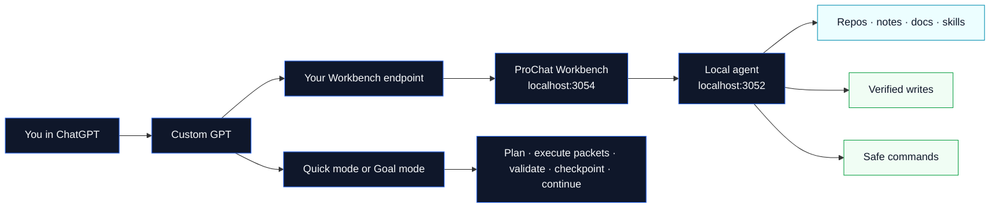
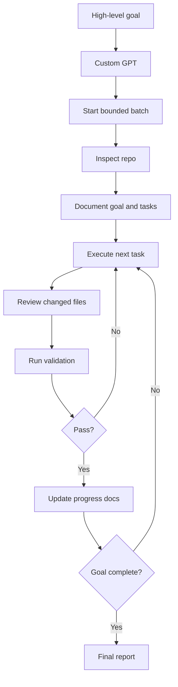

# ProChat Workbench

**ProChat Workbench lets ChatGPT plan and execute substantial work in your real local projects.**

Connect a Custom GPT to your own computer and use ChatGPT as the reasoning interface for local repositories, documentation, plans, notes, and knowledge folders. Workbench provides guarded local execution, persistent goals, exact context, validation, checkpoints, and explicit-path Git operations.

ProChat Workbench is free, self-hosted, and local-first. It is designed to reduce the cost and friction of AI-assisted development by using the ChatGPT interface you already have instead of requiring a separate hosted coding-agent API for ordinary workflows.

```text
Public product: ProChat Workbench
Technical engine and internal identifier: BuildFlow
```

BuildFlow repository names, package scopes, scripts, source IDs, and internal API routes remain technical compatibility identifiers. The canonical public GPT action operation IDs use Workbench names, and the retired BuildFlow hostname is no longer a public compatibility dependency.

If this project helps you, please **star it, fork it, try it on a real repo, open issues, request features, and share what you build with it.**



## Why ProChat Workbench exists

AI coding tools are powerful, but they often work in the wrong place.

A remote model may not see your local repo. A browser chat may not be able to run your local tests. A CLI agent may have strong execution but weak long-term planning context. Copying files back and forth wastes time and breaks flow.

ProChat Workbench bridges that gap through the BuildFlow engine.

It keeps ChatGPT as the main interface while your own machine remains the source of truth. Your Custom GPT can ask BuildFlow for exact repo context, read the files it needs, write verified changes back to disk, run allowlisted validation commands, and keep a progress trail.

The result is a ChatGPT-first workflow for real local projects.

## What you can build with it

ProChat Workbench is useful for much more than asking questions about a codebase.

You can use it to:

- build a new app feature from a single high-level goal
- refactor an existing app across multiple files
- fix failing endpoints or broken tests
- create and update project documentation
- generate implementation plans, specs, runbooks, and task lists
- improve your personal knowledge repo, brain repo, or notes system
- maintain prompt libraries, skill folders, and project docs
- search across multiple projects from ChatGPT
- review repo structure before starting work
- safely apply code edits with verified file operations
- validate JSON files, type checks, tests, and package scripts
- run named security scans over changed files
- prepare clean git diffs, staged file lists, commits, and push flows with guardrails
- create handoff prompts for Codex, Claude Code, your IDE, or another local tool
- continue planning or reviewing from your phone while your local machine hosts the repo connector

## The value in one sentence

**ProChat Workbench lets you use ChatGPT as the reasoning layer and your local computer as the execution layer.**

That means you can brainstorm, inspect, plan, edit, validate, and iterate on real local projects without turning every task into a separate hosted API workflow.

## Key features

### ChatGPT-first local repo access

ProChat Workbench exposes a Custom GPT action schema through the BuildFlow engine so ChatGPT can talk to your Workbench endpoint.

Your GPT can:

- check Workbench status
- list connected sources
- lock an explicit `sourceId` for the chat
- inspect file trees
- search indexed local files
- prepare focused task context with a deterministic exact read plan
- read exact files
- create planning artifacts
- apply safe file changes
- run allowlisted validation commands
- complete small, explicit repo-assistant tasks without autonomous loops

### Local source management

Add repos, notes, docs, skills, or business folders as BuildFlow sources.

BuildFlow supports:

- one or multiple active sources
- Git branch metadata for configured repositories (`branchName`, available branch count, and worktree flag)
- branch-aware activation for configured linked Git worktrees that share the same Git common directory
- local indexing and search
- recursive repo discovery from a root folder
- auto-generated source IDs and labels
- account-style grouping by folder
- manual reindexing
- optional per-source auto-index settings
- searchable status reporting for ChatGPT and the dashboard

Branch-aware activation works on configured checkouts and worktrees. When a repo has multiple configured branch worktrees, enabling/disabling or activating one configured branch expands to the configured siblings in the same repo group. BuildFlow does not silently check out every Git branch inside one working tree; create linked Git worktrees and add/discover them as sources when you want simultaneous branch access.

### Verified file writes

BuildFlow can write files, but it does not blindly mutate your machine.

It supports:

- create
- append
- overwrite
- patch
- move
- rename
- mkdir
- rmdir
- delete file
- delete directory where policy allows
- dry-run / preflight checks
- confirmation-required operations
- verified write results with `verified:true`

The current repo-maintainer profile is intentionally practical for fast repo-assistant work. It can edit normal app code, tests, docs, scripts, package manifests, framework config, Docker files, Prisma files, migrations, and source-controlled project assets without stopping for every routine change.

A write is not considered successful unless BuildFlow verifies it on disk.

### Safe command runner

BuildFlow can run repo-local commands through a strict allowlist.

Supported command families include:

- git status, diff, branch, and log checks
- cached git diff checks
- explicit `git add -- <paths>` only
- commit flows after validation, plus push flows only when explicitly requested, with safe path, message, remote, branch, and force-push checks
- JSON validation with `python3 -m json.tool`
- package type checks and tests
- safe package scripts by name, including scripts from the repo root
- marker-based test runs where supported
- named security scans
- BuildFlow verification scripts

BuildFlow does **not** expose arbitrary shell execution. More command capability should be added as named, source-relative command kinds instead of unrestricted terminal access.

### Fast Repo Assistant workflow

BuildFlow has one Custom GPT workflow: fast repo assistance.

ChatGPT does the reasoning and coding. BuildFlow provides exact local context, guarded file writes, targeted validation, and explicit Git operations. It does not run a separate autonomous agent loop.

Use this default flow:

```text
Question -> minimal exact read -> answer
Small edit -> exact read -> patch -> smallest validation -> optional commit -> stop
Large goal -> concise plan -> first safe slice -> resume point
```

Recommended task budget:

```text
Default: 1 task per response
Clear small batch: up to 2 tightly related tasks
Hard action budget: 3 BuildFlow actions per response, preferably 1-2
Push: only when explicitly requested
```

This keeps ChatGPT powerful while avoiding the main latency failure mode: long chains of model reasoning plus action calls.

BuildFlow should not move open-ended planning, coding, review, or repair into a server-side state machine. For speed, BuildFlow should only batch deterministic mechanical work when it reduces action chatter, such as exact multi-file reads, write preflight, targeted validation, compact diagnostics, and commit-specific-paths operations.

### Persistent resume and handoff

For larger work, use a repo-local progress document or handoff file. A new Custom GPT conversation can read it, verify source scope and git status, and continue from the next unchecked task.

The Custom GPT should update the handoff after each meaningful chunk with completed work, next task, validation evidence, blockers, rollback notes, and resume instructions.

That means a later conversation can say:

```text
Resume BuildFlow work on source <sourceId> from the progress document.
```

BuildFlow can then read the handoff document, verify source scope and git status, and continue from the next unchecked task.

### OpenAI Custom GPT interface limits

BuildFlow cannot directly rename ChatGPT’s native conversation titles, batch names, or input placeholder. Those UI elements are controlled by OpenAI’s ChatGPT interface, not by the BuildFlow action schema.

The practical workaround is to use one source per conversation, start prompts with the source name, and rely on persistent repo-local handoff documents. If your ChatGPT client supports manually renaming a conversation, rename it to the repo or goal.

## Effective Fast Repo Assistant Prompts

Use this pattern for serious work:

```text
Use BuildFlow on source <sourceId>.

Goal:
<describe the feature, fix, refactor, or app you want built>

Work mode:
- Read only the exact context needed.
- Make the smallest safe change or create a concise plan.
- Run the smallest relevant validation after code/config/schema changes.
- Commit explicit changed paths when validation is clean or the change is docs-only.
- Stop with a concise result and the next concrete action.

Validation:
Use targeted type checks, tests, JSON validation, security scans, or git status checks only when they add useful evidence.

Git:
Commit only explicit paths. Push only if I explicitly ask.
```

### Example: build a feature

```text
Use BuildFlow on source tradebot.

Goal:
Implement the missing failing endpoint fixes and make the API test suite pass.

Inspect the repo, make a concise implementation plan, complete the first safe slice, run targeted validation, and stop with the next concrete action.

Do not ask for intermediate approval unless BuildFlow requires confirmation. Commit explicit validated paths when appropriate.
```

### Example: build a module

```text
Use BuildFlow on source my-app.

Goal:
Build a complete project intake module with pages, API routes, validation, tests, and documentation.

Use repo-local conventions. Inspect before writing. Complete the first safe slice, validate only what is relevant, commit explicit paths when appropriate, and report the next task.
```

### Example: refactor safely

```text
Use BuildFlow on source prochat.

Goal:
Refactor the account settings flow into a cleaner service/module structure without changing external behavior.

Document the current structure and risks, plan the refactor, complete the first safe task, run targeted validation, and stop with a resume point.
```

### Example: improve a knowledge repo

```text
Use BuildFlow on source brain.

Goal:
Clean up my AI skills folder, improve naming consistency, add README files where useful, and create an index of the most important skills.

Complete a bounded batch, but stop if BuildFlow blocks access to private or secret folders.
```

### Example: prepare a commit

```text
Use BuildFlow on source buildflow.

Goal:
Improve the dashboard source picker onboarding flow.

Validate the change, commit it with a clear message, and stop before pushing unless I ask.
```

## What BuildFlow can do today

BuildFlow Local currently includes:

- local dashboard on `http://127.0.0.1:3054/dashboard`
- local agent on `http://127.0.0.1:3052`
- relay support for reachable Custom GPT endpoints
- source management for repos, notes, docs, skills, and local folders
- recursive repository discovery from a root folder
- local indexing and search
- active source context selection
- multi-source context support
- read batching for large files and large response budgets
- safe write mode controls
- dry-run and preflight write checks
- practical repo-maintainer write permissions for app, docs, scripts, config, migrations, assets, and package manifests
- confirmation-gated sensitive writes
- verified file operations
- local activity feedback for Custom GPT actions
- dashboard activity overview
- local plans and tasks
- local plan import/export
- dynamic handoff prompts for Codex and Claude Code
- safe command runner for validation and git workflow checks
- fast repo-assistant workflow for small explicit tasks
- repo-local handoff docs with resume instructions
- conversation source-locking guidance for multiple simultaneous GPT chats
- first-run setup checklist
- user-owned Custom GPT OpenAPI endpoint setup

## Safety, benefits, and risks

BuildFlow is powerful because it connects ChatGPT to your local workspace. That also means it needs clear boundaries.

### Benefits

- ChatGPT can work with real files instead of pasted snippets.
- Your local repos remain the source of truth.
- Short implementation batches can be planned, executed, reviewed, validated, and committed in one ChatGPT workflow.
- Writes are policy-checked and verified.
- Commands are allowlisted instead of arbitrary.
- Routine repo-maintainer work can continue without constant confirmation stops.
- Sensitive paths require confirmation or remain blocked.
- You can keep project planning, implementation notes, and final reports together.
- Interrupted work can resume from repo-local handoff docs.

### Risks

- Any tool that can edit files can break code if given a vague or risky goal.
- A Custom GPT can misunderstand intent if the prompt is ambiguous.
- Long-running work can touch many files, so review diffs before committing.
- Command execution must stay allowlisted; unrestricted shell would be unsafe.
- Secrets and real environment values should not be exposed to ChatGPT.
- Push flows should run only when explicitly requested. Deployment flows should stay allowlisted rather than arbitrary shell.

### Important limitations

BuildFlow does not silently edit real `.env` files, expose secrets, run arbitrary shell commands, force-push, or deploy with unrestricted terminal access.

Routine app work is intentionally less interrupted now: package manifests, framework config, Docker files, scripts, migrations, and source-controlled assets can be edited under the repo-maintainer policy. The hard boundary is secrets, generated/runtime output, unsafe paths, and irreversible operations.

These actions are intentionally blocked or confirmation-gated:

- `.env` and `.env.*`
- private keys and credentials
- `.git/**`
- `node_modules/**`
- build outputs such as `.next/**`, `dist/**`, `build/**`, and `coverage/**`
- generated/runtime/log output
- path traversal and absolute paths outside a source
- binary writes unless explicitly supported
- lockfile changes
- GitHub workflow changes
- license changes
- destructive deletes
- deployment-like operations unless a future allowlisted command supports them

The goal is not to give a Custom GPT unlimited machine control. The goal is to give it enough structured local capability to build real software safely.

## Quick start

BuildFlow Local runs on your machine.

```bash
pnpm install
pnpm local:restart
```

Then open:

```text
http://127.0.0.1:3054/dashboard
```

The dashboard guides you through setup:

1. confirm the local agent is running
2. copy your OpenAPI endpoint
3. add or discover local sources
4. index sources
5. choose active context
6. review write mode
7. create a local plan
8. connect your Custom GPT

## Connect a Custom GPT

In the Custom GPT editor, import the BuildFlow action schema from your own endpoint.

Use one of these:

```text
Local reference file:
docs/openapi.chatgpt.json

Local running endpoint:
http://127.0.0.1:3054/api/openapi

Endpoint for a Custom GPT:
https://<your-domain-or-tunnel>/api/openapi
```

Use your own tunnel, reverse proxy, or domain. The public GitHub version is self-hosted; your Custom GPT should call an endpoint you control.

Then add the instructions from:

```text
docs/CUSTOM_GPT_INSTRUCTIONS.md
```

After changing the schema or instructions, re-import the action definition in the GPT editor, save the GPT, and start a new chat so ChatGPT uses the updated actions.

## Practical recommendation

For everyday questions, just ask normally:

```text
What does this repo do?
Find where the auth flow is implemented.
Read the README and suggest improvements.
```

For implementation work, be explicit:

```text
Use BuildFlow on source <sourceId>. Complete up to 3 small tasks, validate and commit each one, then stop with the next task.
```

For protected work, add boundaries:

```text
Do not change dependencies, edit migrations, touch deployment files, or run destructive cleanup unless I explicitly confirm.
```

## How the workflow feels



## Custom GPT actions

ProChat Workbench exposes exactly five Custom GPT actions:

- `getWorkbenchStatus`
- `readWorkbenchContext`
- `applyWorkbenchFileChange`
- `commitWorkbenchChanges`
- `runWorkbenchCommand`

These actions let ChatGPT inspect, read, write, validate, commit, and continue a bounded Fast Repo Assistant flow without pretending it has unrestricted local access.

There is no Custom GPT action for changing dashboard active context. The GPT locks a `sourceId` conversationally after `getWorkbenchStatus?include=sources` and passes that explicit `sourceId` on every repo action. Legacy `/api/actions/agent/*` polling routes are retired and must not be imported into the GPT schema.

## Who BuildFlow is for

BuildFlow is for:

- indie hackers building apps with ChatGPT
- developers who want local-first AI workflows
- teams experimenting with Custom GPTs over internal repos
- people maintaining large note, brain, or skill folders
- consultants who want repeatable AI-assisted implementation workflows
- builders who want the planning quality of ChatGPT with the grounding of local files
- anyone who wants to reduce copy-paste between chat, repo, docs, and terminal

## What BuildFlow is not

BuildFlow Local is not a hosted backend, not an unrestricted terminal bridge, and not a replacement for reviewing your own code.

It is the local context, safety, and execution layer between ChatGPT and your workspace.

Use it to reason, plan, inspect, read, write verified changes, run safe validation, and work through implementation goals with guardrails.

## Product docs

Useful docs:

- [`docs/product/README.md`](docs/product/README.md) — product index
- [`docs/product/agent-mode.md`](docs/product/agent-mode.md) — Bounded Sequential Mode
- [`docs/product/chatgpt-first-workflow.md`](docs/product/chatgpt-first-workflow.md) — ChatGPT-first strategy
- [`docs/product/public-scope.md`](docs/product/public-scope.md) — public BuildFlow Local scope
- [`docs/product/local/feature-scope.md`](docs/product/local/feature-scope.md) — Local feature scope
- [`docs/openapi.chatgpt/README.md`](docs/openapi.chatgpt/README.md) — Custom GPT action import guide
- [`docs/CUSTOM_GPT_INSTRUCTIONS.md`](docs/CUSTOM_GPT_INSTRUCTIONS.md) — GPT instructions

## Roadmap ideas

ProChat Workbench Local is moving toward a more complete ChatGPT-first local repository workspace.

Public areas worth exploring include:

- richer activity history;
- better dashboard progress views;
- clearer handoff and resume persistence;
- more repository-agnostic command recipes;
- safer local command profiles;
- better diff previews;
- improved setup for non-technical users;
- reusable local skill packages.

Open an issue if you have a local-first workflow Workbench should support.

## Licensing

The generated public Workbench Local repository is licensed under the GNU Affero General Public License v3.0 only (`AGPL-3.0-only`). See [`LICENSE`](LICENSE).

A separate commercial or OEM license may be available for organizations that need proprietary embedding, redistribution, or modified hosted use. See [`COMMERCIAL-LICENSING.md`](COMMERCIAL-LICENSING.md). ProChat trademarks are governed separately by [`TRADEMARKS.md`](TRADEMARKS.md).

The private engineering repository is the authoritative source. Public releases are deterministic, reviewed snapshots generated from exact private commits. Managed services, private modules, customer operations, and internal commercial material are not part of the public snapshot.

The dashboard includes a source-code link. Operators of modified network-accessible versions must provide the corresponding source required by the AGPL.

## Contributing

ProChat Workbench Local is free, self-hosted, and open source.

- Star or fork the public repository.
- Try it on a repository you control.
- Share feedback, issues, and feature requests.
- Do not include secrets, private logs, or customer data.
- Review [`CONTRIBUTING.md`](CONTRIBUTING.md) before submitting code.

```text
github.com/prochattools/prochat-workbench
```

External code contributions require contributor terms that preserve ProChat's ability to distribute accepted work under both AGPL and separate commercial licenses. Issues and design feedback do not require a contributor agreement.

Workbench is still early, but it is already useful. The best way to improve it is to use it on real work and explain where the workflow still feels slow, risky, or magical in the wrong way.
